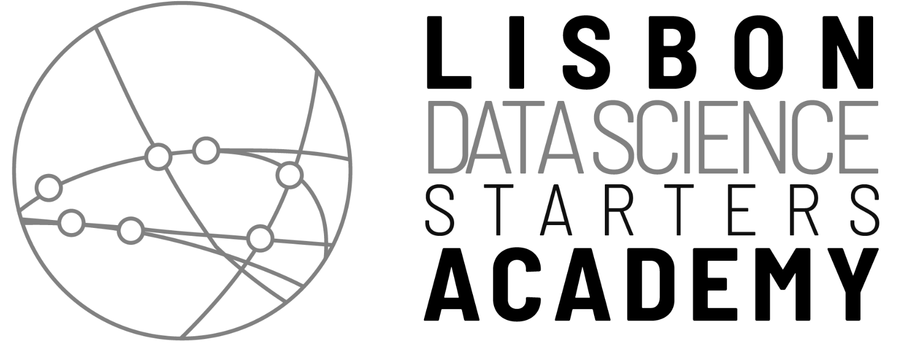
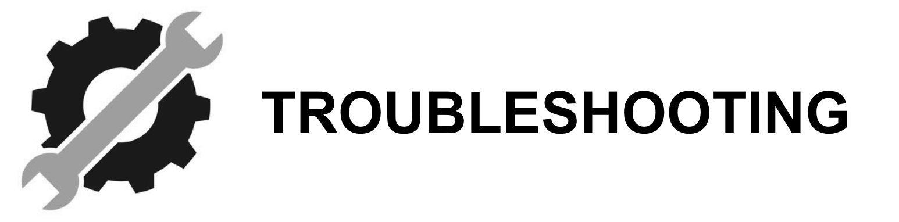

# Batch 9 Students Repository

Welcome to **Lisbon Data Science Starters Academy Batch 9** Students Repository!

Your first step in this journey is to **carefully read** the steps in this tutorial. ⚠️ **Important**: Make sure to complete all the steps during the setup week, **21.9. - 27.9. 2025**. If you are struggling with any of the steps, contact us in the #setup channel on Slack! In this tutorial, you'll learn:

- Slack usage and etiquette;
- How to setup your software environment to be able to run Jupyter notebooks with Python 3.12;
- The learning unit workflow to follow during the LDSSA.

Everything else you need to know should be [on our wiki](https://ldssa.github.io/wiki/).

## 0. Important dates and info

### 0.1 LDSSA schedule
Official batch 9 [google calendar](https://calendar.google.com/calendar/u/0?cid=Y183NDk2MWIwZjYzMTRiODVlMzY1NjNlYjI0MzQ5MDkxZWQ3ODM3Nzk5ZDEzOTQxNGE5YjZjODBjYTNjOTQ2NzEyQGdyb3VwLmNhbGVuZGFyLmdvb2dsZS5jb20). All times are Lisbon times.

| What | When |
| --- | --- |
| Registration for admissions | 23 Jun - 6 Jul 2025 |
| Admission exams | 7 Jul - 3 Aug 2025 |
| Scholarship interviews | Aug 2025 |
| Admissions closed | 1 Sep 2025 |
| Student info session | 14 Sep 2025, 10 am |
| Setup week | 14 Sep  - 20 Sep 2025 |
| Specialization 01 + Bootcamp classes | 21 Sep - 18 Oct 2025 |
| Hackathon 01 | 19 Oct 2025 |
| Specialization 02 | 20 Oct - 15 Nov 2025 |
| Hackathon 02 | 16 Nov 2025 |
| Specialization 03 | 17 Nov - 13 Dec 2025 |
| Hackathon 03 | 14 Dec 2025 |
| Christmas break |  |
| Specialization 04 | 5 -31 Jan 2026 |
| Hackathon 04 | 1 Feb 2026 |
| Specialization 05 | 2 - 28 Feb 2026 |
| Hackathon 06 | 1 Mar 2026 |
| Specialization 06 | 2 - 28 Mar 2026 |
| HCKT 06 | 29 Mar 2026 |
| Easter break | 30 Mar - 5 Apr 2026 "
| Capstone | 6 Apr - 28 Jun 2026 |
| Graduation | 29 Jun 2026 |

Hackathons start at 8.45 am and end around 6.30 pm.

### 0.2 Release dates of the learning materials
| Specialization | Learning unit | Date |
| --- | --- | --- |
| S01 | learning notebooks SLU04 - SLU10 | 14 Sep 2025|
| S01 | exercise notebooks SLU04-10,   learning and exercise notebooks SLU11-19 | 21 Sep 2025 |
| S02 | BLU01, BLU02, BLU03 | 20 Oct, 27 Oct, 3 Nov 2025 |
|S03 | BLU04, BLU05, BLU06 | 17 Nov, 24  Nov, 1 Dec 2025 |
| S04 | BLU07, BLU08, BLU09 | 5 Jan, 12 Jan, 19 Jan 2026 |
| S05 | BLU10, BLU11, BLU012 | 3 Feb, 10 Feb, 17 Feb 2026 |
| S06 | BLU13, BLU14, BLU15 | 3 Mar, 10 Mar, 17 Mar 2026 |
| Capstone | 6 Apr 2026 |

### 0.3 Bootcamp
There will be two bootcamp days with online classes (two Sunday mornings, about 4 hours each). 
- Day 1, 21 Sep 2025 with SLU04 - SLU10
- Day 2, 28 Sep 2025 with SLU11 - SLU17

Each class is about 60 min, including questions.

**Day 1, 21 Sep 2025, 9.30 am**
| Time | Instructor | Topic |
| --- | --- | --- |
| 9.30 am | ? | Intro + icebreaker |
| 10 am | ? | Intro to data science   SLU04 - Basic Stats with Pandas   SLU05 - Covariance and Correlation   SLU06 - Dealing with Data Problems |
| 11 am | ? | SLU07 - Regression with Linear Regression   SLU08 - Metrics for Regression |
| 12 am | ? | SLU09 - Classification with Logistic Regression   SLU10 - Metrics for Classification |

**Day 2, 28 Sep 2025, 9.30 am**
| Time | Instructor | Topic |
| --- | --- | --- |
| 9.30 am | ? | SLU11 - Tree-Based Models   SLU12 - Feature Engineering |
| 10.30 am | ? | SLU13 - Bias-Variance tradeoff & Model Selection   SLU14 - Model complexity and Overfitting   SLU15 - Hyperparameter Tuning |
| 11.30 am | ? | SLU16 - Workflow   SLU17 - Ethics and Fairness |

### 0.3 Capstone schedule  
| Week nr. | What happens | Dates |
| --- | ---- | --- |
| 1 | students receive client email and data   and send an email with questions to the client | 6 - 12 Apr 2026 |
| 2 | instructors prepare client clarifications | 13 - 17 Apr 2026 |
| 2 - 4 | students prepare report 1 | 13 Apr - 3 May 2026 |
| 5 | instructors correct report 1 | 4 - 10 May 2026 |
| 5 - 8 | students prepare report 2 | 4 - 31 May 2026 |
| 7 | API test requests | 18 - 24 May 2026 |
| 8 | final API requests | 25 - 31 May 2026 |
| 9 | instructors correct report 2 | 1 - 7 Jun 2026 |
| 9 - 10 | students improving reports 1 and 2 | 1 - 14 Jun 2026 |
| 11 | final instructor corrections of reports 1 and 2 | 15 - 21 Jun 2026 |
| 12 | student presentations | 22 - 28 Jun 2026 |

## 1. How to use Slack and how to ask for help

First and foremost, we'll talk about how to use our communication tool, Slack. You will learn how to use it effectively and how to use it to ask for help. Click on the image to follow the link.

<table>
  <tr>
    <td>
         
    </td>
  </tr>
</table>

## 2. Initial Setup

At the end of this part, you should have Python 3.12 installed in your machine. Please choose your operating system:

<table>
  <tr>
    <td>
        
    </td>
    <td>
        
    </td>
    <td>
        
    </td>
  </tr>
</table>

## 3. Setup _Git_ and _GitHub_

Click on the image to follow the link.

<table>
  <tr>
    <td>
        
    </td>
  </tr>
</table>

## 4. Setup for all operating systems - Python virtual environment

Click on the image to follow the link.

<table>
  <tr>
    <td>
        
    </td>
  </tr>
</table>

## 5. LDSSA learning units workflow

The workflow that you will follow every time that learning new material is released. Click on the image to follow the link.

<table>
  <tr>
    <td>
        
    </td>
  </tr>
</table>

## 6. Troubleshooting 

A few common problems and solutions. If you don't find what you're looking for, check out the #setup channel on Slack. Click on the image to follow the link.

<table>
  <tr>
    <td>
        
    </td>
  </tr>
</table>

