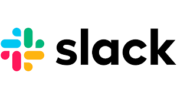
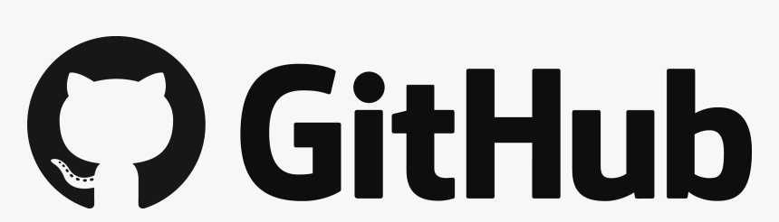
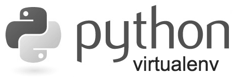
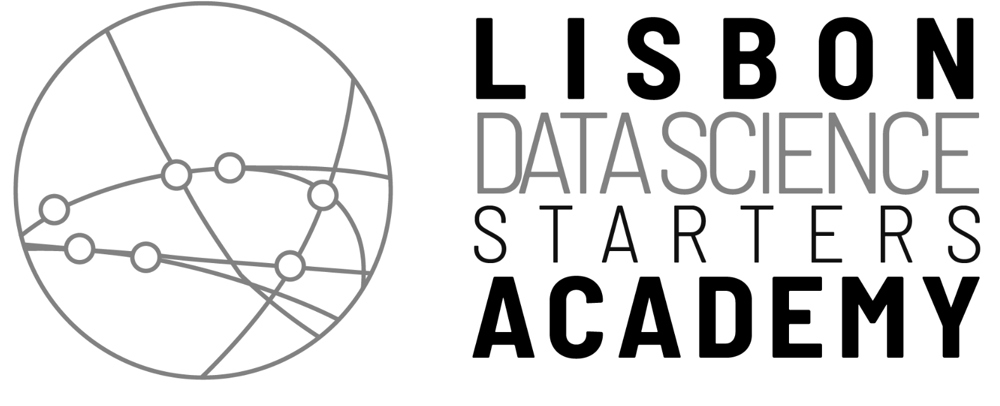
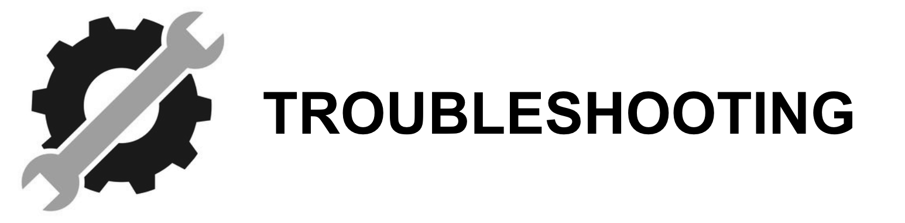

# Batch 10 Students Repository

Welcome to **Lisbon Data Science Starters Academy Batch 10** Students Repository!

Your first step in this journey is to **carefully read** the steps in this tutorial. ⚠️ **Important**: Make sure to complete all the steps during the setup week, **18–24 October 2026**. If you are struggling with any of the steps, contact us in the #setup channel on Slack! In this tutorial, you'll learn:

- Slack usage and etiquette;
- How to set up the Batch 10 software environment with Ubuntu 26.04 LTS (on Linux or WSL) and Python 3.14;
- The learning unit workflow to follow during the LDSSA.

Everything else you need to know should be [on our wiki](https://ldssa.github.io/wiki/).

If you never studied basic statistics or need a refresher, take a look at [this repo](https://github.com/RoberVega/EDIT-DSBA-QSAM)  prepared by our instructor Roberto Álvarez.

## 0. Important dates and information — 2026/27

All dates use **Europe/Lisbon**, including daylight saving time. The official public schedule is maintained on the [LDSSA Wiki](https://ldssa.github.io/wiki/Starters%20Academy%20(LDSSA)/01-Starters-Academy-(Course)/#3-schedule). Always check the deadline displayed in the Portal for each Learning Unit.

| Activity | Date / deadline |
| --- | --- |
| Signup and registration completion | 24 September – 15 October 2026 |
| Scholarship interviews | 12–16 October 2026 |
| Payment | 12–17 October 2026 |
| Introductory session | 18 October 2026 |
| Setup | 18–24 October 2026 |
| Bootcamp classes | 25 October and 1 November 2026 |
| S01 | 25 October – 21 November 2026 |
| Hackathon 1 | 22 November 2026 |
| S02 | 23 November – 19 December 2026 |
| Hackathon 2 | 20 December 2026 |
| Christmas/New Year break | 21 December 2026 – 4 January 2027 |
| S03 | 5–31 January 2027 |
| Hackathon 3 | 1 February 2027 |
| S04 | 2–28 February 2027 |
| Hackathon 4 | 1 March 2027 |
| S05 | 2–27 March 2027 |
| Hackathon 5 | 28 March 2027 |
| S06 | 29 March – 24 April 2027 |
| Hackathon 6 | 25 April 2027 |
| Spring break | 26 April – 2 May 2027 |
| Capstone | 3 May – 28 June 2027 |
| Graduates announced | 29 June 2027 |

Batch 10 is fully remote and uses **no-exam admissions**. There is no admission exam, random selection or attendance-preference survey. Applicants verify their email, accept the policies and choose whether to request a scholarship. Enrollment requires payment and staff verification. Scholarship refusal ends the application; it does not convert to a full-fee application.

**SLU01–17 are mandatory S01 course units.** SLU18, SLU19, SLU32 and SLU64 are optional. Certificate eligibility requires a score of at least 16/20 in every mandatory exercise notebook by its deadline, attendance on both Bootcamp class days, attendance at Hackathons 1 and 6, no more than one missed Hackathon among Hackathons 2–5, and successful completion of the remaining course requirements. Failing to complete S01 by its deadline or missing Hackathon 1 prevents progression to later course activities. Missing a later specialization deadline or Hackathon 6 removes certificate eligibility, but does not by itself stop continued study. Contact staff if a Portal outage affected your submission.

### 0.1 Release dates of the learning materials

Release announcements are posted in `#announcements` on Slack. Pull this repository after each announcement.

| Specialization | Learning material | Student release date |
| --- | --- | --- |
| S01 | SLU01–10 learning notebooks | 18 October 2026 |
| S01 | SLU01–10 exercise notebooks; SLU11–19, SLU32 and SLU64 learning and exercise materials | 25 October 2026 |
| S02 | BLU01, BLU02 and BLU03 | 23 November, 30 November and 7 December 2026 |
| S03 | BLU04, BLU05 and BLU06 | 5 January, 12 January and 19 January 2027 |
| S04 | BLU07, BLU08 and BLU09 | 2 February, 9 February and 16 February 2027 |
| S05 | BLU10, BLU11 and BLU12 | 2 March, 9 March and 16 March 2027 |
| S06 | BLU13, BLU14 and BLU15 | 29 March, 5 April and 12 April 2027 |
| Capstone | Capstone materials | 3 May 2027 |

### 0.2 Bootcamp

The remote Bootcamp has two class days of approximately four hours each. Attendance on both days is required for certificate eligibility. SLU01–03 are mandatory self-study units. SLU18, SLU19, SLU32 and SLU64 are optional and are not presented during the Bootcamp.

Each class is approximately 60 minutes, including questions. All times use Europe/Lisbon.

**Day 1 — Sunday, 25 October 2026**

| Time | Instructor | Topic |
| --- | --- | --- |
| 09:30 | To be announced | Introduction and icebreaker |
| 10:00 | To be announced | Introduction to data science; SLU04 — Basic Statistics with Pandas; SLU05 — Covariance and Correlation; SLU06 — Dealing with Data Problems |
| 11:00 | To be announced | SLU07 — Linear Regression; SLU08 — Metrics for Regression |
| 12:00 | To be announced | SLU09 — Logistic Regression; SLU10 — Metrics for Classification |

**Day 2 — Sunday, 1 November 2026**

| Time | Instructor | Topic |
| --- | --- | --- |
| 09:30 | To be announced | SLU11 — Tree-Based Models; SLU12 — Feature Engineering |
| 10:30 | To be announced | SLU13 — Bias–Variance Trade-off and Model Selection; SLU14 — Model Complexity and Overfitting; SLU15 — Hyperparameter Tuning |
| 11:30 | To be announced | SLU16 — Workflow; SLU17 — Ethics and Fairness |

Hackathons are full-day remote Sunday events. Their exact arrival, submission, presentation and closing times are published in each Hackathon brief.

### 0.3 Ask Me Anything sessions

Ask Me Anything sessions give you an opportunity to meet senior instructors and ask questions about each specialization. Session dates, topics and instructors will be announced on Slack.

### 0.4 Capstone schedule

The Batch 10 Capstone runs from **3 May to 28 June 2027**. It retains the same phases as the previous edition, but the detailed dates and time assigned to each phase will be announced in due time.

| Phase | Activity | Date / period |
| --- | --- | --- |
| Client briefing | Students receive the client brief and data and send their questions to the client | To be announced |
| Client clarification | Instructors prepare and provide client clarifications | To be announced |
| Stage 1 | Students prepare Report 1 and the first version of the application | To be announced |
| Report 1 review | Instructors review Report 1 and provide comments | To be announced |
| Stage 2 | Students prepare Report 2 and improve their project | To be announced |
| App trial | Test requests are sent so students can verify their applications | To be announced |
| App evaluation | Final API requests and ground-truth updates are sent | To be announced |
| Report 2 review | Instructors review Report 2 and provide comments | To be announced |
| Improvements | Students improve Reports 1 and 2 in response to feedback | To be announced |
| Final review | Instructors complete the final review of both reports | To be announced |
| Presentations | Students present their Capstone projects | To be announced |

## 1. How to use Slack and how to ask for help

First and foremost, we'll talk about how to use our communication tool, Slack. You will learn how to use it effectively and how to use it to ask for help. Click on the image to follow the link.

<table>
  <tr>
    <td>
         
    </td>
  </tr>
</table>

## 2. Initial Setup

At the end of this part, you should have Python 3.14 installed in your machine. Please choose your operating system:

<table>
  <tr>
    <td>
        
    </td>
    <td>
        
    </td>
    <td>
        
    </td>
  </tr>
</table>

## 3. Setup _Git_ and _GitHub_

Click on the image to follow the link.

<table>
  <tr>
    <td>
        
    </td>
  </tr>
</table>

## 4. Setup for all operating systems - Python virtual environment

Click on the image to follow the link.

<table>
  <tr>
    <td>
        
    </td>
  </tr>
</table>

## 5. LDSSA learning units workflow

The workflow that you will follow every time that learning new material is released. Click on the image to follow the link.

<table>
  <tr>
    <td>
        
    </td>
  </tr>
</table>

## 6. Troubleshooting

A few common problems and solutions. If you don't find what you're looking for, check out the #setup channel on Slack. Click on the image to follow the link.

<table>
  <tr>
    <td>
        
    </td>
  </tr>
</table>
