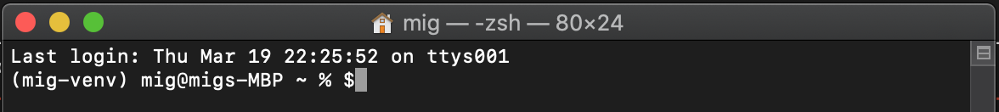

# Setup instructions for macOS

Batch 10 uses **Python 3.14**. The same native Homebrew workflow works on Intel and Apple Silicon Macs.

## 1. Open Terminal

Open Terminal in either of these ways:

- In Finder, open `/Applications/Utilities`, then double-click **Terminal**.
- Press <kbd>Command</kbd> + <kbd>Space</kbd>, type `Terminal`, and press <kbd>Enter</kbd>.



## 2. Install the command-line tools and Homebrew

Run:

```bash
xcode-select --install
```

If the command-line tools are already installed, macOS will tell you. Then install Homebrew using its official installer:

```bash
/bin/bash -c "$(curl -fsSL https://raw.githubusercontent.com/Homebrew/install/HEAD/install.sh)"
```

At the end of the installation, Homebrew may print commands under **Next steps** for adding `brew` to your shell. Run those exact commands before continuing. This is especially important on Apple Silicon Macs, where Homebrew normally uses `/opt/homebrew`.

Verify Homebrew:

```bash
brew --version
```

## 3. Install Git and Python 3.14

```bash
brew update
brew install git python@3.14
```

Verify both installations:

```bash
git --version
python3.14 --version
```

The Python output must start with `Python 3.14`.

Use the native Apple Silicon installation on M-series Macs. Rosetta and an Intel-only Homebrew installation are not required for the standard Batch 10 setup. If a specific course dependency later requires an Intel compatibility workaround, instructors will provide that unit-specific procedure.

You are ready to return to the main README and continue with Git and GitHub setup.
