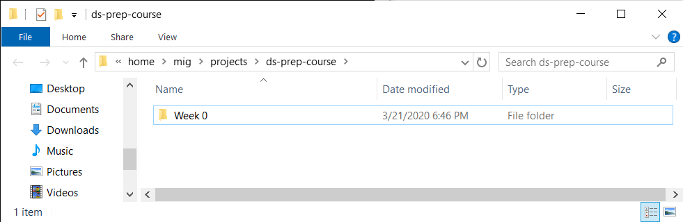
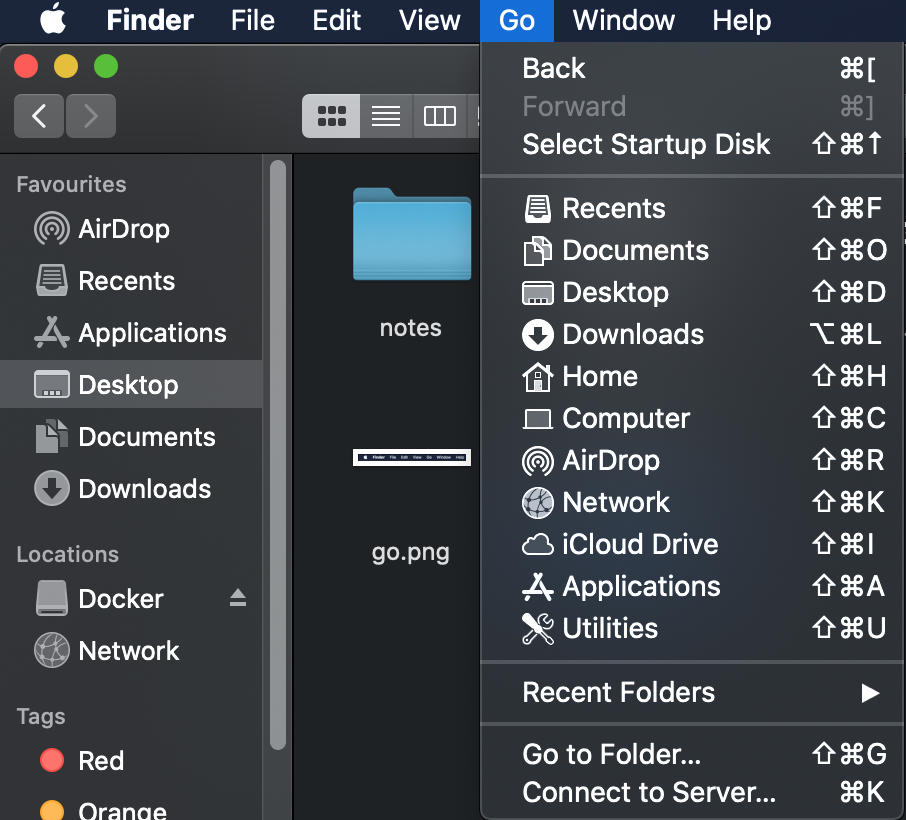
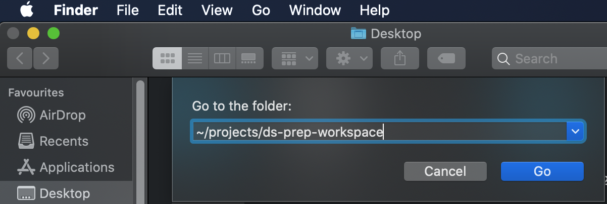

# Using the operating system interface to access local repositories

The commands below open the directory you are currently using in the operating system's file manager. Use `batch-students` to view published material and `batch10-workspace` for the notebooks you edit and submit.

## WSL with Ubuntu

Enter the repository and open Windows File Explorer at that location:

```bash
cd ~/projects/batch10-workspace
explorer.exe .
```

The final dot means “the current directory” and must be included. Windows Explorer will open directly in `batch10-workspace`.



## macOS

In Finder, open the **Go** menu and select **Go to Folder…**.


Enter the repository path and select **Go**:

```text
~/projects/batch10-workspace
```




